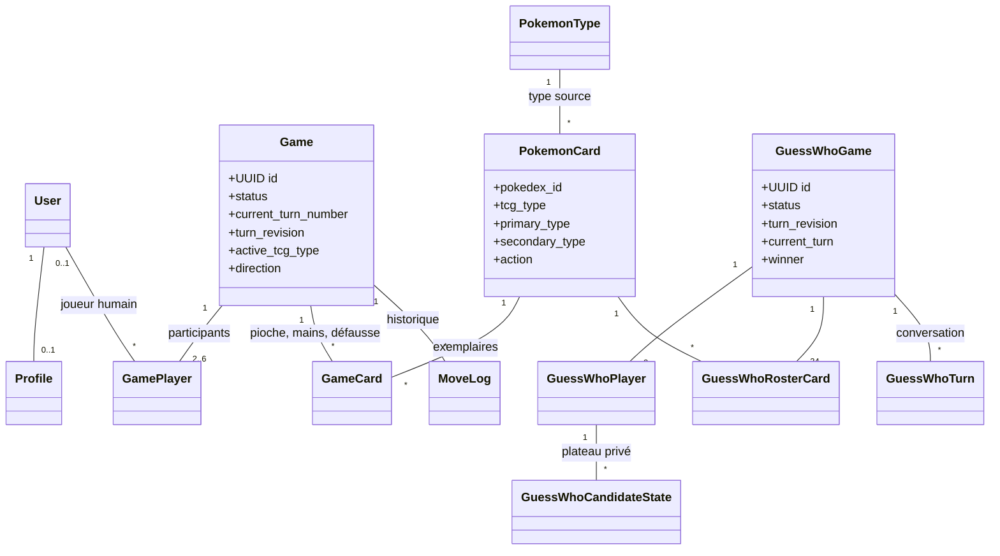
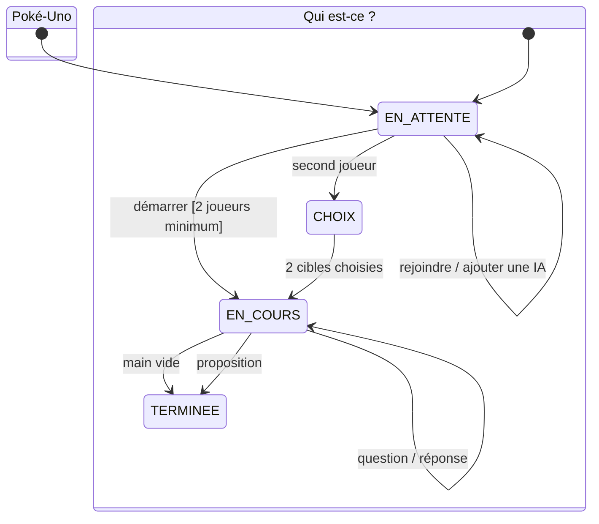

# PokéTable

PokéTable est une plateforme Django de jeux de société Pokémon multijoueurs. Elle réunit actuellement **Poké‑Uno**, un jeu de défausse jouable de 2 à 6 participants avec des adversaires IA, et **Qui est-ce ? Pokémon**, un duel de déduction à 2 joueurs avec questions/réponses intégrées.

**Auteurs :** Hugo Raguin, Amine Taleb, Rizlene Berrag

## Jeux et règles

### Poké‑Uno

- Chaque joueur reçoit 7 cartes. Le premier à vider sa main gagne.
- Une carte est jouable si elle partage le **type JCC** ou l’**espèce** de la défausse.
- Les cartes légendaires et les cartes `+4` sont des jokers : le joueur choisit le prochain type JCC.
- `+2` et `+4` font piocher la cible et sautent son tour, **Inversion** change le sens, et **Protection** annule la prochaine pénalité reçue.
- Piocher termine le tour. Lorsque la pioche est vide, la défausse est remélangée en conservant sa carte supérieure.
- Le vainqueur marque les points des mains adverses : 10 points par carte normale et 25 par légendaire.
- L’hôte peut ajouter ou retirer des IA avant le départ. Leur décision est validée par le même moteur serveur que celle d’un humain.

Le jeu emploie les 10 types de cartes Pokémon imprimés dans le JCC moderne : **Plante, Feu, Eau, Électrique, Psy, Combat, Obscurité, Métal, Dragon et Incolore**. Chaque carte possède exactement un type JCC, visible avec son symbole officiel. Les 18 types du jeu vidéo restent des métadonnées Pokédex, notamment utiles aux questions du Qui est-ce, mais ne pilotent plus la compatibilité Poké‑Uno.

Le catalogue actif contient 54 espèces, chacune présente deux fois dans la pioche :

| Type JCC | Espèces | Cartes physiques |
| --- | ---: | ---: |
| Plante | 6 | 12 |
| Feu | 5 | 10 |
| Eau | 6 | 12 |
| Électrique | 5 | 10 |
| Psy | 6 | 12 |
| Combat | 5 | 10 |
| Obscurité | 5 | 10 |
| Métal | 5 | 10 |
| Dragon | 5 | 10 |
| Incolore | 6 | 12 |

L’écart maximal est donc de 2 cartes physiques entre les types. La sélection couvre toujours les 18 types source, les 3 lignées complètes de starters et 5 légendaires ou fabuleux de la première génération.

Références officielles : [règles françaises du JCC Pokémon](https://www.pokemon.com/static-assets/content-assets/cms2-fr-fr/pdf/trading-card-game/rulebook/par_rulebook_fr.pdf) et [base de données des cartes Pokémon](https://www.pokemon.com/uk/pokemon-tcg/pokemon-cards?format=unlimited).

### Qui est-ce ? Pokémon

- L’hôte ouvre une table et un second joueur la rejoint.
- Le plateau commun de 24 Pokémon est figé à la création de la partie.
- Chaque joueur choisit secrètement la cible que l’autre doit découvrir. Le serveur ne transmet jamais ce choix à l’adversaire avant la fin.
- À son tour, un joueur pose une question. L’adversaire répond **Oui** ou **Non**, puis récupère le tour.
- Chaque plateau est privé : cliquer une carte la rabat ou la relève sans modifier celui de l’adversaire.
- À la place d’une question, le joueur peut proposer un Pokémon. Une bonne proposition gagne immédiatement ; une mauvaise donne la victoire à l’adversaire.
- L’historique des questions, réponses et propositions sert de conversation intégrée et se synchronise automatiquement.

## Démarrage rapide

```bash
cp .env.example .env
docker compose up --build
```

L’application est disponible sur <http://localhost:8000>. Le conteneur web attend PostgreSQL et Redis, puis exécute automatiquement les migrations, le seed local du catalogue et `collectstatic`.

Créer un administrateur :

```bash
docker compose exec web python manage.py createsuperuser
```

En local avec `uv` :

```bash
uv sync
uv run python manage.py migrate
uv run python manage.py seed_pokemon_cards
uv run python manage.py runserver
```

Commandes de qualité :

```bash
task check
task lint
task test
```

## Architecture logicielle



`GameCard` représente une carte physique d’une partie Poké‑Uno. Sa position est déterminée par `location` et un `order_index` monotone : aucune pile n’est stockée dans un blob JSON. `PokemonCard.tcg_type` porte la règle publique du jeu, tandis que `primary_type` et `secondary_type` conservent les données Pokédex.

Les deux moteurs métier sont séparés des vues :

- `game/game_engine.py` gère la pioche, les coups, pouvoirs, tours et scores de Poké‑Uno ;
- `game/bot_player.py` contient la stratégie déterministe des IA ;
- `guesswho/services.py` gère le roster, les secrets, la conversation, les plateaux privés et la victoire du Qui est-ce.

L’inscription affiche la liste des critères que le mot de passe doit remplir. `game/password_rules.py` dérive cette liste de `AUTH_PASSWORD_VALIDATORS`, puis marque chaque critère respecté ou manquant à partir des erreurs renvoyées par le serveur ; `game/static/game/js/signup.js` met les mêmes critères à jour pendant la frappe, en reproduisant les calculs des validateurs Django. Le serveur reste seul juge : le critère « mot de passe trop courant » n’est vérifié qu’à l’envoi.

Toutes les actions de tour sensibles s’exécutent dans une transaction avec verrou de partie. Un compteur `turn_revision` écarte les requêtes périmées : une action issue d’un ancien état reçoit une réponse `409` avec l’état frais au lieu d’être appliquée au mauvais tour.

### Machines à états



## Synchronisation et sécurité

- Authentification et sessions Django, formulaires protégés par CSRF.
- Validation serveur du tour, de la propriété des cartes et de chaque règle : modifier une requête navigateur ne permet pas de tricher.
- Les mains Poké‑Uno adverses ne sont jamais sérialisées ; seuls leurs nombres de cartes sont publics.
- Les cibles du Qui est-ce restent privées jusqu’à la fin et les cartes rabattues ne sont visibles que par leur propriétaire.
- Le polling léger actualise les lobbies et parties sans rechargement manuel. Les requêtes sont suspendues quand l’onglet n’est pas visible et reprennent au retour.
- Les messages et erreurs sont échappés par les templates Django ; aucun HTML utilisateur n’est injecté côté client.

## UI/UX et Design System

L’identité « salon de jeux nocturne » repose sur des tokens centralisés dans `static/tokens.css` : couleurs JCC, surfaces, contrastes, espaces, rayons, ombres et durées. Les composants suivent l’Atomic Design :

- **atomes** dans `static/atoms.css` : boutons, badges, symboles d’énergie, cartes 3D, champs ;
- **molécules** dans `static/molecules.css` : mains en éventail, pioche, défausse, indicateurs de tour, sélecteur de type ;
- **organismes** dans `static/organisms.css` : navigation, accueil multijeux, lobbies et tables complètes.

Le plateau Poké‑Uno tient dans le viewport sans scroll de page. Les mains disposent de leur propre axe horizontal quand elles deviennent longues. Les cartes suivent légèrement le pointeur avec profondeur et reflet, et les actions de pioche/pose sont animées du point de vue de chaque joueur. `prefers-reduced-motion` désactive ces effets pour les personnes qui le demandent. Les contrôles conservent des cibles tactiles d’au moins 44 px, des états `focus-visible`, des annonces `aria-live` et un lien d’évitement.

## Docker, tests et CI

- Image Python slim exécutée par un utilisateur non-root.
- Compose : Django, PostgreSQL 16, Redis 7, volumes persistants et healthchecks.
- Fixture Pokémon committée : aucun appel réseau n’est requis au démarrage.
- Tests Django couvrant modèles, migrations, moteurs, actions spéciales, IA, confidentialité, concurrence logique, endpoints et rendu HTML.
- Ruff et Black sont exécutés avec la suite dans `.github/workflows/ci.yml` à chaque push et pull request.

## Choix techniques

- **Python 3.13** : Django 6 exige Python 3.12 ou plus.
- **Polling plutôt que WebSocket** : adapté à ces jeux au tour par tour et plus simple à exécuter avec le serveur WSGI demandé. Une évolution ASGI reste possible.
- **JavaScript natif** pour les interactions temps réel : aucun framework ni CDN JavaScript au runtime.
- **Icônes d’énergie JCC** chargées depuis le domaine officiel Pokémon, avec préconnexion ; les sprites du catalogue sont eux aussi des URL figées dans la fixture.

Le cahier des charges d’origine est conservé dans [`.claude/skills/projet-cartes/SKILL.md`](.claude/skills/projet-cartes/SKILL.md).
