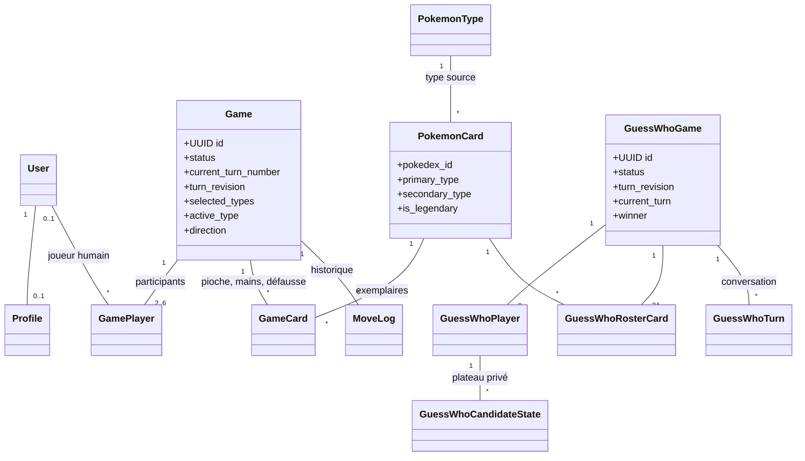
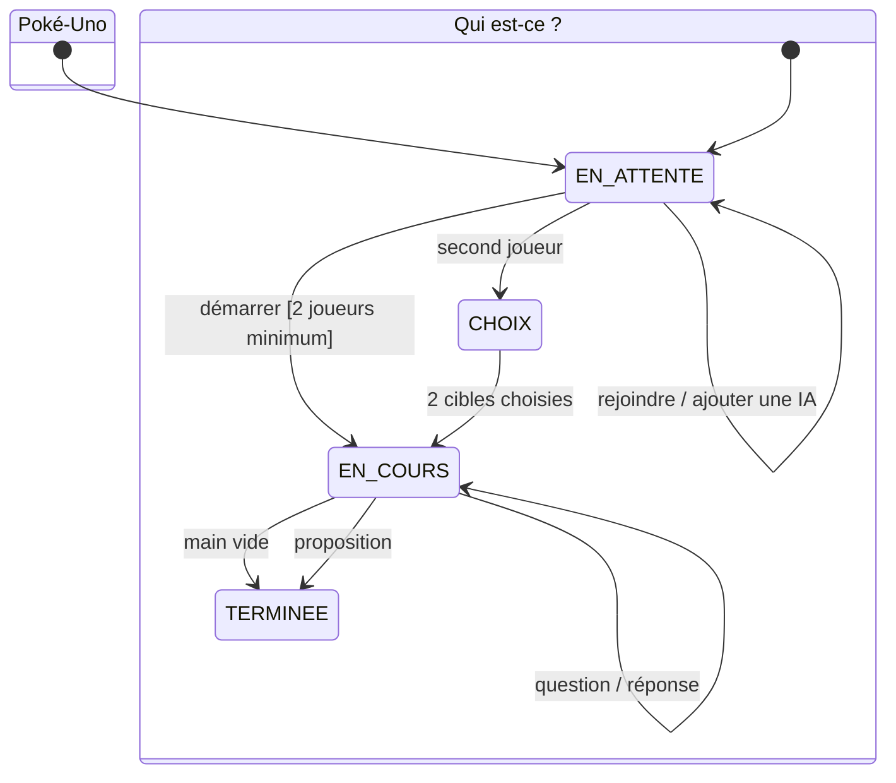

# PokéTable

PokéTable est une plateforme Django de jeux de société Pokémon multijoueurs. Elle réunit quatre jeux : **Poké‑Uno**, un jeu de défausse de 2 à 6 participants avec des adversaires IA ; **Qui est-ce ? Pokémon**, un duel de déduction à 2 joueurs ; **Qui est ce Pokémon ?**, une course à la silhouette ouverte à autant de joueurs qu'on veut ; et **Pictionary Pokémon**, où un joueur dessine pendant que les autres devinent.

**Auteurs :** Hugo Raguin, Amine Taleb, Rizlene Berrag

## Jeux et règles

### Poké‑Uno

- Au démarrage, la partie **tire 4 types Pokémon au sort** (parmi les 18 des jeux vidéo) et les révèle par une animation. Toute la pioche est composée de ces types.
- Chaque joueur reçoit 7 cartes. Le premier à vider sa main gagne.
- Une carte est jouable si elle **partage un type** avec la défausse ou si c'est la **même espèce**. Un Pokémon à double type sert donc de passerelle entre deux couleurs de la partie.
- Les cartes légendaires et les cartes `+4` sont des jokers : le joueur choisit lequel des 4 types de la partie sera imposé au suivant.
- `+2` et `+4` font piocher la cible et sautent son tour, **Inversion** change le sens, et **Protection** annule la prochaine pénalité reçue.
- Piocher termine le tour. Lorsque la pioche est vide, la défausse est remélangée en conservant sa carte supérieure.
- Le vainqueur marque les points des mains adverses : 10 points par carte normale et 25 par légendaire.
- L’hôte peut ajouter ou retirer des IA avant le départ. Leur décision est validée par le même moteur serveur que celle d’un humain.

### Composition d'une pioche

Le catalogue en base contient tout le Pokédex : `seed_pokemon_cards` charge 1024 espèces exploitables sur les 1025 de PokeAPI, avec leurs types authentiques. Chaque partie y puise sa propre pioche :

| Étape | Règle |
| --- | --- |
| Types de la partie | 4 types tirés au sort parmi ceux comptant assez d'espèces |
| Espèces par type | 20 (une espèce bi-type peut servir deux types de la partie) |
| Exemplaires | 2 par espèce, soit environ 150 cartes |
| Cartes à effet | 10 % des espèces en `+2`, 10 % en Inversion, 10 % en Protection, 5 % en `+4` |

Les pouvoirs sont donc tirés par partie et non figés sur une espèce du catalogue : sans cela, un tirage aléatoire ne contiendrait presque jamais de carte à effet. Les deux exemplaires d'une même espèce partagent toujours le même pouvoir, ce qui reste mémorisable en cours de partie. Les légendaires n'en reçoivent pas : ils sont déjà des jokers.

Références officielles : [règles françaises du JCC Pokémon](https://www.pokemon.com/static-assets/content-assets/cms2-fr-fr/pdf/trading-card-game/rulebook/par_rulebook_fr.pdf) et [base de données des cartes Pokémon](https://www.pokemon.com/uk/pokemon-tcg/pokemon-cards?format=unlimited).

### Qui est-ce ? Pokémon

- L’hôte ouvre une table et un second joueur la rejoint.
- Le plateau commun de 24 Pokémon est figé à la création de la partie.
- Chaque joueur choisit secrètement la cible que l’autre doit découvrir. Le serveur ne transmet jamais ce choix à l’adversaire avant la fin.
- À son tour, un joueur pose une question. L’adversaire répond **Oui** ou **Non**, puis récupère le tour.
- Chaque plateau est privé : cliquer une carte la rabat ou la relève sans modifier celui de l’adversaire.
- À la place d’une question, le joueur peut proposer un Pokémon. Une bonne proposition gagne immédiatement ; une mauvaise donne la victoire à l’adversaire.
- L’historique des questions, réponses et propositions sert de conversation intégrée et se synchronise automatiquement.

### Qui est ce Pokémon ?

- L'hôte choisit la longueur de la partie : **5, 10 ou 15 manches**. Le nombre de joueurs est libre.
- Chaque manche affiche la **silhouette** d'un Pokémon de la première génération. Tout le monde répond en même temps, au clavier.
- Deux indices tombent tout seuls : le **type** après 5 secondes, puis le **nombre de lettres avec la première et la dernière** après 10 secondes.
- Le score décroît avec le temps : 1000 points à la seconde 0, 100 au bout des 30 secondes de la manche. Chaque joueur marque selon *sa* rapidité, la manche ne s'arrête donc pas au premier trouvé.
- La manche se révèle quand tout le monde a trouvé ou que le temps est écoulé, puis la suivante démarre après 5 secondes.

L'illustration passe par un proxy (`/qui-est-ce-pokemon/rounds/<id>/image/`) qui renvoie une **vraie silhouette calculée côté serveur** : ni le Pokédex ID, ni le nom, ni l'URL du sprite ne quittent le serveur avant la révélation, et un filtre CSS retiré depuis le navigateur ne révèle rien.

### Pictionary Pokémon

- L'hôte choisit **3, 6 ou 9 manches**, et il faut au moins 2 joueurs.
- À chaque manche, le crayon passe au joueur suivant : lui seul reçoit le nom du Pokémon à faire deviner (Gen 1) et peut tracer sur la toile.
- Les autres écrivent leurs propositions. Un devineur marque de 600 à 100 points selon sa rapidité sur les 90 secondes, et le **dessinateur gagne 150 points par joueur qui trouve** : son intérêt est de dessiner vite et clair.
- Les traits sont synchronisés par polling incrémental : chaque client ne redemande que les traits qu'il n'a pas encore (`?since=<sequence>`), ce qui évite de renvoyer tout le dessin à chaque tour.

### Quêtes, boutique et collection

- Les quatre jeux alimentent des **quêtes** quotidiennes et hebdomadaires (parties jouées, victoires, silhouettes reconnues, dessins devinés). Les moteurs déclenchent des évènements ; `game/quests.py` décide de ce qu'ils font avancer.
- Une quête terminée se récupère à la main sur `/quetes/` et crédite des **points**. La remise à zéro est implicite : chaque progression est stockée avec sa période (jour ou semaine ISO), aucune tâche planifiée n'est nécessaire.
- Les trois quêtes **hebdomadaires** ajoutent un booster aux points : l'encaissement crée un `BoosterTicket`, qui apparaît en tête de boutique et s'ouvre gratuitement. Le ticket est marqué ouvert plutôt que supprimé, ce qui garde la trace de ce qu'une quête a rapporté.
- Les points s'échangent contre des **boosters** sur `/boutique/`. Le tirage, le débit et l'ajout à la collection se font côté serveur (`game/shop.py`) : le navigateur ne reçoit les cartes qu'une fois l'achat enregistré.
- L'ouverture est mise en scène : le sachet se déchire en 3D, les cartes se retournent une à une, et la rareté se voit avant l'étiquette — liseré bleu et reflet holographique pour une rare, halo doré et éclair de scène pour un légendaire, prisme qui balaie l'illustration en boucle et salle entière au prisme pour une carte ex.
- Les cartes se collectionnent par **saison** (`game/seasons.py`) : un même Pokémon se possède une fois par édition, la saison fait partie de la clé unique de `CollectionCard`. La collection affiche une saison à la fois, avec ses onglets d'avancement.
  - **Saison 1 — Set de Base** : les visuels de première édition, trois raretés (fixture `game/fixtures/tcg_card_images.json`).
  - **Saison 2 — Série 151** : la réédition moderne (set TCGdex `sv03.5`, fixture `game/fixtures/tcg_card_images_151.json`), qui ajoute une rareté au-dessus des légendaires — la **carte ex**. Douze Pokémon (3, 6, 9, 24, 38, 40, 65, 76, 115, 124, 145, 151) y prennent leur illustration pleine page. Une même espèce peut changer de rang d'une saison à l'autre : Dracaufeu est rare en saison 1 et ex en saison 2.
- Les deux fixtures se régénèrent avec `manage.py fetch_tcg_card_images --saison 1|2` (`task tcg:refresh` et `task tcg:refresh:151`).

| Booster | Saison | Prix | Contenu |
| --- | --- | ---: | --- |
| Set de Base | 1 | 150 pts | 5 cartes · 82 % commune, 15 % rare, 3 % légendaire |
| Premium | 1 | 400 pts | 5 cartes · une rare garantie, 10 % de légendaire |
| 151 | 2 | 220 pts | 5 cartes · 74 % commune, 20 % rare, 4 % légendaire, 2 % ex |
| 151 Ultra | 2 | 520 pts | 5 cartes · une rare garantie, 10 % de légendaire, 6 % d'ex |

### Jouer sans compte

Les quatre jeux sont ouverts en **mode invité** : un compte temporaire (`Profile.is_guest`) est créé en un clic, ce qui évite de rendre le joueur nullable dans les quatre moteurs. L'invité joue comme un membre mais n'a accès ni à la collection, ni aux quêtes, ni à la boutique, ni aux amis : ces entrées portent un cadenas et mènent à une page qui explique ce que le compte débloque. S'inscrire depuis le mode invité conserve le compte et ses parties. `manage.py purge_guest_accounts` supprime les invités inactifs qui ne sont plus attendus dans un salon.

## Démarrage rapide

```bash
cp .env.example .env
docker compose up --build
```

L’application est disponible sur <http://localhost:8000>. Le conteneur web attend PostgreSQL et Redis, puis exécute automatiquement les migrations, le seed local du catalogue et `collectstatic`.

Créer un administrateur :

```bash
docker compose exec web python manage.py createsuperuser
```

En local avec `uv` :

```bash
uv sync
uv run python manage.py migrate
uv run python manage.py seed_pokemon_cards
uv run python manage.py runserver
```

Commandes de qualité :

```bash
task check
task lint
task test
```

## Architecture logicielle



`GameCard` représente une carte physique d’une partie Poké‑Uno. Sa position est déterminée par `location` et un `order_index` monotone : aucune pile n’est stockée dans un blob JSON. C'est aussi elle qui porte le pouvoir (`action`), tiré au sort pour la partie, tandis que `PokemonCard` ne garde que les données Pokédex partagées par toutes les parties. `Game.selected_types` retient les 4 types tirés et `Game.active_type` le type imposé par le dernier joker.

Les deux moteurs métier sont séparés des vues :

- `game/game_engine.py` gère la pioche, les coups, pouvoirs, tours et scores de Poké‑Uno ;
- `game/bot_player.py` contient la stratégie déterministe des IA ;
- `guesswho/services.py` gère le roster, les secrets, la conversation, les plateaux privés et la victoire du Qui est-ce ;
- `silhouette/services.py` tient l'horloge des manches, les indices minutés et le score dégressif de « Qui est ce Pokémon ? » ;
- `pictionary/services.py` gère la rotation du crayon, les traits et la notation du Pictionary.

Les deux jeux de devinette partagent `game/pokemon_names.py`, qui compare une saisie clavier au nom français ou anglais d'une espèce en ignorant casse, accents et ponctuation.

L’inscription affiche la liste des critères que le mot de passe doit remplir. `game/password_rules.py` dérive cette liste de `AUTH_PASSWORD_VALIDATORS`, puis marque chaque critère respecté ou manquant à partir des erreurs renvoyées par le serveur ; `game/static/game/js/signup.js` met les mêmes critères à jour pendant la frappe, en reproduisant les calculs des validateurs Django. Le serveur reste seul juge : le critère « mot de passe trop courant » n’est vérifié qu’à l’envoi.

Toutes les actions de tour sensibles s’exécutent dans une transaction avec verrou de partie. Un compteur `turn_revision` écarte les requêtes périmées : une action issue d’un ancien état reçoit une réponse `409` avec l’état frais au lieu d’être appliquée au mauvais tour.

### Machines à états



## Synchronisation et sécurité

- Authentification et sessions Django, formulaires protégés par CSRF.
- Validation serveur du tour, de la propriété des cartes et de chaque règle : modifier une requête navigateur ne permet pas de tricher.
- Les mains Poké‑Uno adverses ne sont jamais sérialisées ; seuls leurs nombres de cartes sont publics.
- Les cibles du Qui est-ce restent privées jusqu’à la fin et les cartes rabattues ne sont visibles que par leur propriétaire.
- Le polling léger actualise les lobbies et parties sans rechargement manuel. Les requêtes sont suspendues quand l’onglet n’est pas visible et reprennent au retour.
- Les messages et erreurs sont échappés par les templates Django ; aucun HTML utilisateur n’est injecté côté client.

## UI/UX et Design System

L’identité « salon de jeux nocturne » repose sur des tokens centralisés dans `static/tokens.css` : couleurs de marque, surfaces, contrastes, espaces, rayons, ombres et durées. Les composants suivent l’Atomic Design :

- **atomes** dans `static/atoms.css` : boutons, badges, pastilles de type, cartes 3D, champs ;
- **molécules** dans `static/molecules.css` : mains en éventail, pioche, défausse, indicateurs de tour, sélecteur de type ;
- **organismes** dans `static/organisms.css` : navigation, accueil multijeux, lobbies et tables complètes.

Les 18 types s’affichent avec leurs **pastilles officielles** en PNG (`game/static/game/img/types/`, régénérables par `manage.py fetch_type_icons`) : le symbole blanc sur son disque de couleur, celui des jeux. Elles sont servies depuis nos statiques, donc aucun visuel ne dépend d’un domaine tiers. L’URL part avec l’état de la partie (`icon_url`), car en production le nom du fichier porte une empreinte que le navigateur ne peut pas deviner.

Le plateau Poké‑Uno tient dans le viewport sans scroll de page. Les mains disposent de leur propre axe horizontal quand elles deviennent longues. Les cartes suivent légèrement le pointeur avec profondeur et reflet, et les actions de pioche/pose sont animées du point de vue de chaque joueur. `prefers-reduced-motion` désactive ces effets pour les personnes qui le demandent. Les contrôles conservent des cibles tactiles d’au moins 44 px, des états `focus-visible`, des annonces `aria-live` et un lien d’évitement.

## Docker, tests et CI

- Image Python slim exécutée par un utilisateur non-root.
- Compose : Django, PostgreSQL 16, Redis 7, volumes persistants et healthchecks.
- Fixture Pokémon committée : aucun appel réseau n’est requis au démarrage.
- Tests Django couvrant modèles, migrations, moteurs, actions spéciales, IA, confidentialité, concurrence logique, endpoints et rendu HTML.
- Ruff et Black sont exécutés avec la suite dans `.github/workflows/ci.yml` à chaque push et pull request.

## Choix techniques

- **Python 3.13** : Django 6 exige Python 3.12 ou plus.
- **Polling plutôt que WebSocket** : adapté à ces jeux au tour par tour et plus simple à exécuter avec le serveur WSGI demandé. Une évolution ASGI reste possible.
- **JavaScript natif** pour les interactions temps réel : aucun framework ni CDN JavaScript au runtime.
- **Couleurs de type servies par le serveur** en style inline : les 18 types tiennent ainsi sans dix-huit règles CSS, et les sprites du catalogue restent des URL figées dans la fixture.

Le cahier des charges d’origine est conservé dans [`.claude/skills/projet-cartes/SKILL.md`](.claude/skills/projet-cartes/SKILL.md). Le dossier `.claude/skills/ui-ux-pro-max/` embarque une base de règles UI/UX tierce ([ui-ux-pro-max](https://github.com/nextlevelbuilder/ui-ux-pro-max-skill), MIT) utilisée comme garde-fou de design ; elle est exclue de `ruff` et `black`, qui ne vérifient que notre code.
