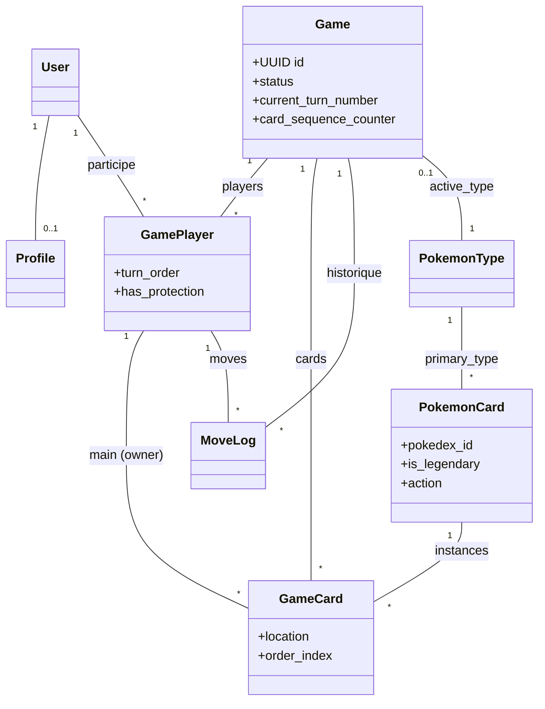
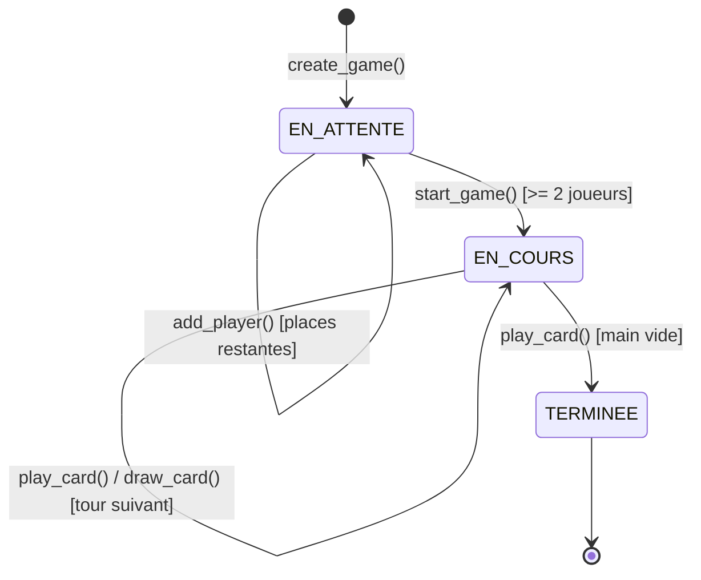

# Poké-Uno

Plateforme web de jeu de cartes façon Uno, avec des cartes Pokémon à la place des enseignes classiques. Projet Django réalisé pour le cours IPSSI (cahier des charges : voir le skill [`projet-cartes`](.claude/skills/projet-cartes/SKILL.md)).

**Auteurs :** Hugo Raguin, Amine Taleb, Rizlene Berrag


*(à ajouter : capture d'écran du plateau de jeu en cours de partie)*

## Règles du jeu

- 2 à 6 joueurs. Chacun reçoit 7 cartes Pokémon en main au démarrage.
- À son tour, un joueur pose une carte de sa main sur la défausse si elle partage un **type** (Feu, Eau, Plante...) ou l'**espèce** (même Pokémon) avec la carte du dessus — sinon il doit piocher.
- Les cartes **légendaires** sont des jokers : elles se posent sur n'importe quelle carte, et leur propriétaire choisit le type imposé au joueur suivant.
- Quatre pouvoirs complètent les cartes normales : **+2** (pioche 2 et passe le tour), **+4** (joker, choisit le type, pioche 4 et passe le tour), **Inversion** (change le sens de jeu) et **Protection** (pose un bouclier personnel).
- Un bouclier reste actif jusqu'au prochain +2/+4 qui vise ce joueur : il annule la pioche et le saut de tour, puis il est consommé.
- Le paquet conserve 108 cartes et équilibre réellement les 18 types : le catalogue actif contient 4 à 5 Pokémon par type, chaque double-type étant compté dans ses deux catégories. Avec 2 exemplaires par espèce, chaque partie contient donc 8 à 10 cartes de chaque type.
- Piocher une carte termine le tour, que le joueur puisse ensuite la jouer ou non (pas de rejeu immédiat en v1).
- Si la pioche est épuisée, la défausse est remélangée (sauf la carte du dessus) pour reconstituer la pioche.
- Le premier joueur à vider sa main gagne la partie. Son score s'incrémente de la valeur des cartes restantes dans la main de chaque adversaire (10 pts/carte normale, 25 pts/carte légendaire).

## Démarrage rapide

```bash
cp .env.example .env   # éditer SECRET_KEY / POSTGRES_PASSWORD si besoin
docker compose up --build
```

L'application est disponible sur http://localhost:8000. Les migrations, le seed des cartes Pokémon (depuis le fixture committé, sans accès réseau) et `collectstatic` s'exécutent automatiquement au démarrage du conteneur `web`.

Pour créer un compte administrateur (accès à `/admin/`) :

```bash
docker compose exec web python manage.py createsuperuser
```

### En local, sans Docker (avec uv)

```bash
uv sync
uv run python manage.py migrate
uv run python manage.py seed_pokemon_cards
uv run python manage.py runserver
```

### Avec Task

```bash
task run     # serveur de dev
task test    # suite de tests
task check   # manage.py check
task lint    # ruff
task docker:up
```

## Architecture logicielle

### Modèles ORM



`GameCard` est la pièce centrale du modèle : une ligne = une carte physique dans une partie précise (pioche, main d'un joueur, ou défausse), positionnée par `location` + `order_index` — pas de blob JSON pour représenter les piles. Un compteur monotone (`Game.card_sequence_counter`) horodate chaque déplacement de carte ; le dessus de la défausse et la prochaine carte à piocher se déduisent d'un simple tri sur `order_index`.

### Machine à états d'une partie



### Séparation des responsabilités (MVT + SRP)

Toute la logique métier (distribution, validation des coups, mélange, tour par tour, fin de partie et score) vit dans `game/game_engine.py`, isolée des vues Django — aucune dépendance à `request`/`response`, testable en pur Python. Les vues (`game/views.py`, `game/api.py`) se contentent d'appeler le moteur et de traduire ses exceptions (`NotYourTurnError`, `InvalidMoveError`, ...) en réponses HTTP.

### Multijoueur en réseau

- Comptes réels via l'authentification Django (inscription/connexion).
- Un lobby permet de créer une partie ou de rejoindre une partie en attente (jusqu'à `max_players`).
- Chaque coup est validé côté serveur (tour du bon joueur, carte réellement en main, règle type/espèce respectée) — impossible de tricher en trafiquant la requête client.
- Le plateau interroge `GET /api/games/<id>/state/` toutes les 2 secondes : plusieurs joueurs connectés depuis des navigateurs différents (y compris sur le même réseau local, via l'IP LAN de la machine hôte) voient la partie évoluer en quasi temps réel sans WebSocket.
- `GameEngine.get_game_state()` ne renvoie **jamais** la main d'un adversaire (seulement son nombre de cartes) — règle portée par le moteur, vérifiée par des tests bout en bout sur l'endpoint HTTP réel.

## Choix UI/UX & Design Tokens

- **Design Tokens** (`static/tokens.css`) : une variable de couleur par type Pokémon (18 teintes, qui jouent le rôle de la "couleur" Uno), plus espacements, typographie, rayons et transitions. Aucune couleur ni espacement codé en dur ailleurs — `atoms.css`/`molecules.css`/`organisms.css` ne font que consommer ces variables.
- **Atomic Design** :
  - *Atomes* (`atoms.css`) : `.card-unit` (une carte), `.badge` (type/statut), `.btn`.
  - *Molécules* (`molecules.css`) : `.player-hand` (main d'un joueur), `.deck-stack` (pioche), `.discard-pile`, `.turn-indicator` (indicateur de tour actif).
  - *Organismes* (`organisms.css`) : `.game-table` (plateau complet), `.score-board` (tableau des scores en fin de partie).
- **Retour visuel** : transition CSS au survol/jeu d'une carte, halo vert (`--color-turn-active`) sur le joueur dont c'est le tour.
- **Frontend interactif** : Vue 3 (vendorisé localement dans `static/vendor/`, pas de CDN externe au runtime) monté uniquement sur `.game-table`, qui réutilise exactement les mêmes classes CSS que les pages server-rendered — les Design Tokens/Atomic Design du cahier des charges s'appliquent donc identiquement, que le HTML soit rendu par Django ou par Vue.

## Qualité, tests & CI

- 55 tests Django (`game/tests/`) : modèles (contraintes d'unicité), moteur de jeu (distribution, actions, mélange, validation des coups, rotation du tour, score), vues/API (permissions, CSRF, synchronisation, anti-fuite de la main adverse), rendu du plateau et équilibrage des 18 types.
- Lint `ruff` + formatage `black` (config dans `pyproject.toml`, 110 colonnes, migrations exclues).
- CI GitHub Actions (`.github/workflows/ci.yml`) : services PostgreSQL + Redis, lint, format check, migrations, suite de tests — à chaque push et pull request.

## Journal d'architecture & auto-évaluation

Déviations assumées par rapport au cahier des charges, documentées ici plutôt que silencieuses :

- **Python 3.13 au lieu de `python:3.11-slim`** littéralement mentionné dans le sujet : Django 6.0 exige Python ≥ 3.12.
- **Vue 3 vendorisé** plutôt qu'un `<script src="cdn...">` : le critère éliminatoire « démarre sans erreur via `docker compose up` » ne doit pas dépendre d'un accès réseau tiers au runtime.
- **Catalogue actif de 54 Pokémon** (voir `game/management/commands/_pokedex_selection.py`) : les 18 types apparaissent chacun 4 ou 5 fois, double-types compris, tout en conservant les 3 lignées de starters et les 5 légendaires/mythiques de la Gen 1. Deux exemplaires de chaque espèce donnent une pioche stable de 108 cartes et seulement 2 cartes d'écart entre le type le plus rare et le plus fréquent. Les anciennes espèces déjà utilisées par une partie sont conservées pour l'historique mais désactivées des nouvelles pioches.
- **Polling (2s) plutôt que WebSocket** pour synchroniser l'état entre joueurs : suffisant pour un jeu au tour par tour, et beaucoup plus simple à containeriser correctement (pas de serveur ASGI dédié à mettre en place dans le temps imparti). Piste d'amélioration évidente pour une v2.
- **Piocher termine toujours le tour** (pas de "piocher puis rejouer si jouable" comme dans certaines variantes d'Uno) : règle simplifiée pour une v1, à faire évoluer si le temps le permet.

Difficultés rencontrées : la représentation correcte de la pioche/main/défausse en base relationnelle (sans blob JSON) a demandé de définir une règle unique et non ambiguë (`order_index` + compteur monotone par partie) plutôt que trois mécanismes différents — une fois cette règle posée, la pioche, la défausse et le remélange s'expriment tous comme de simples `order_by`/`filter`, ce qui a beaucoup simplifié les tests.

Répartition du travail : *(à compléter par l'équipe — qui a porté le moteur de jeu, qui a porté les Design Tokens/Atomic Design, qui a porté Docker/CI/README)*.
