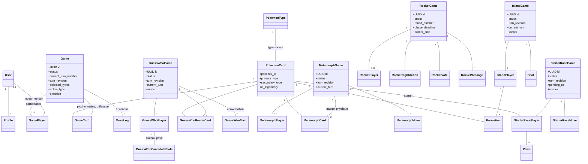
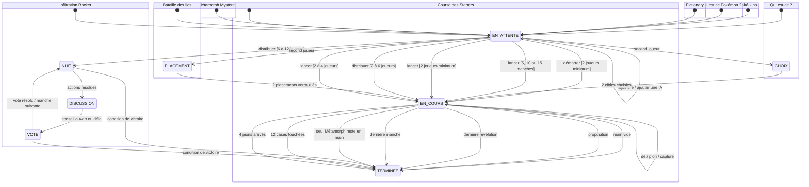

# PokéTable

PokéTable est une plateforme Django de jeux de société Pokémon multijoueurs. Elle réunit huit modes complets : **Poké‑Uno**, **Qui est-ce ? Pokémon**, **Qui est ce Pokémon ?**, **Pictionary Pokémon**, **Métamorph Mystère**, **Infiltration Rocket**, **Bataille des Îles** et **Course des Starters**. Les parties se jouent dans le navigateur, en compte membre ou invité, avec un serveur Django seul arbitre des règles et des informations secrètes.

**Auteurs :** Hugo Raguin, Amine Taleb, Rizlene Berrag

## Jeux et règles

| Jeu | Joueurs | Format | URL du lobby |
| --- | ---: | --- | --- |
| Poké‑Uno | 2–6, IA possibles | Défausse et pouvoirs | `/uno/` |
| Qui est-ce ? Pokémon | 2 | Déduction en duel | `/qui-est-ce/` |
| Qui est ce Pokémon ? | sans limite fixe | Silhouettes chronométrées | `/qui-est-ce-pokemon/` |
| Pictionary Pokémon | 2+ | Dessin et devinettes | `/pictionary/` |
| Métamorph Mystère | 2–6 | Paires et carte perdante | `/metamorph-mystere/` |
| Infiltration Rocket | 6–12 | Rôles cachés, débat et vote | `/infiltration-rocket/` |
| Bataille des Îles | 2 | Bataille navale Pokémon | `/bataille-des-iles/` |
| Course des Starters | 2–4 | Course de pions et dé | `/course-des-starters/` |

### Poké‑Uno

- Au démarrage, la partie **tire 4 types Pokémon au sort** (parmi les 18 des jeux vidéo) et les révèle par une animation. Toute la pioche est composée de ces types.
- Chaque joueur reçoit 7 cartes. Le premier à vider sa main gagne.
- Une carte est jouable si elle **partage un type** avec la défausse ou si c'est la **même espèce**. Un Pokémon à double type sert donc de passerelle entre deux couleurs de la partie.
- Les cartes légendaires et les cartes `+4` sont des jokers : le joueur choisit lequel des 4 types de la partie sera imposé au suivant.
- `+2` et `+4` font piocher la cible et sautent son tour, **Inversion** change le sens, et **Protection** annule la prochaine pénalité reçue.
- Piocher termine le tour. Lorsque la pioche est vide, la défausse est remélangée en conservant sa carte supérieure.
- Le vainqueur marque les points des mains adverses : 10 points par carte normale et 25 par légendaire.
- L’hôte peut ajouter ou retirer des IA avant le départ. Leur décision est validée par le même moteur serveur que celle d’un humain.

### Composition d'une pioche

Le catalogue en base contient tout le Pokédex : `seed_pokemon_cards` charge 1024 espèces exploitables sur les 1025 de PokeAPI, avec leurs types authentiques. Chaque partie y puise sa propre pioche :

| Étape | Règle |
| --- | --- |
| Types de la partie | 4 types tirés au sort parmi ceux comptant assez d'espèces |
| Espèces par type | 20 (une espèce bi-type peut servir deux types de la partie) |
| Exemplaires | 2 par espèce, soit environ 150 cartes |
| Cartes à effet | 10 % des espèces en `+2`, 10 % en Inversion, 10 % en Protection, 5 % en `+4` |

Les pouvoirs sont donc tirés par partie et non figés sur une espèce du catalogue : sans cela, un tirage aléatoire ne contiendrait presque jamais de carte à effet. Les deux exemplaires d'une même espèce partagent toujours le même pouvoir, ce qui reste mémorisable en cours de partie. Les légendaires n'en reçoivent pas : ils sont déjà des jokers.

Références officielles : [règles françaises du JCC Pokémon](https://www.pokemon.com/static-assets/content-assets/cms2-fr-fr/pdf/trading-card-game/rulebook/par_rulebook_fr.pdf) et [base de données des cartes Pokémon](https://www.pokemon.com/uk/pokemon-tcg/pokemon-cards?format=unlimited).

### Qui est-ce ? Pokémon

- L’hôte ouvre une table et un second joueur la rejoint.
- Le plateau commun de 24 Pokémon est figé à la création de la partie.
- Chaque joueur choisit secrètement la cible que l’autre doit découvrir. Le serveur ne transmet jamais ce choix à l’adversaire avant la fin.
- À son tour, un joueur pose une question. L’adversaire répond **Oui** ou **Non**, puis récupère le tour.
- Chaque plateau est privé : cliquer une carte la rabat ou la relève sans modifier celui de l’adversaire.
- À la place d’une question, le joueur peut proposer un Pokémon. Une bonne proposition gagne immédiatement ; une mauvaise donne la victoire à l’adversaire.
- L’historique des questions, réponses et propositions sert de conversation intégrée et se synchronise automatiquement.

### Qui est ce Pokémon ?

- L'hôte choisit la longueur de la partie : **5, 10 ou 15 manches**. Le nombre de joueurs est libre.
- Chaque manche affiche la **silhouette** d'un Pokémon de la première génération. Tout le monde répond en même temps, au clavier.
- Deux indices tombent tout seuls : le **type** après 5 secondes, puis le **nombre de lettres avec la première et la dernière** après 10 secondes.
- Le score décroît avec le temps : 1000 points à la seconde 0, 100 au bout des 30 secondes de la manche. Chaque joueur marque selon *sa* rapidité, la manche ne s'arrête donc pas au premier trouvé.
- La manche se révèle quand tout le monde a trouvé ou que le temps est écoulé, puis la suivante démarre après 5 secondes.

L'illustration passe par un proxy (`/qui-est-ce-pokemon/rounds/<id>/image/`) qui renvoie une **vraie silhouette calculée côté serveur** : ni le Pokédex ID, ni le nom, ni l'URL du sprite ne quittent le serveur avant la révélation, et un filtre CSS retiré depuis le navigateur ne révèle rien.

### Pictionary Pokémon

- L'hôte choisit **3, 6 ou 9 manches**, et il faut au moins 2 joueurs.
- À chaque manche, le crayon passe au joueur suivant : lui seul reçoit le nom du Pokémon à faire deviner (Gen 1) et peut tracer sur la toile.
- Les autres écrivent leurs propositions. Un devineur marque de 600 à 100 points selon sa rapidité sur les 90 secondes, et le **dessinateur gagne 150 points par joueur qui trouve** : son intérêt est de dessiner vite et clair.
- Les traits sont synchronisés par polling incrémental : chaque client ne redemande que les traits qu'il n'a pas encore (`?since=<sequence>`), ce qui évite de renvoyer tout le dessin à chaque tour.

### Métamorph Mystère

- Une table accueille **2 à 6 joueurs**. L'hôte lance la partie à partir de deux participants.
- Le serveur fabrique un paquet de **12 paires de Pokémon plus l'unique Métamorph #132**, mélange puis distribue les cartes. Toute paire déjà présente dans une main est posée automatiquement.
- À son tour, un joueur choisit un dos numéroté dans la main du joueur précédent selon le sens de jeu. L'API ne lui envoie ni identifiant de carte, ni nom, ni sprite avant le tirage.
- La carte piochée rejoint la main ; si sa jumelle s'y trouve, les deux cartes sont immédiatement retirées et la paire devient publique.
- Un joueur sans carte reçoit son rang et est sauté dans les tours suivants. Quand il ne reste qu'une main, son propriétaire détient forcément Métamorph : il termine dernier, tous les autres gagnent dans leur ordre de sortie.

### Infiltration Rocket

- Il faut **6 à 12 joueurs**. La distribution contient 1 agent Rocket jusqu'à 7 joueurs, 2 de 8 à 10, puis 3 de 11 à 12, ainsi qu'un **Détective Looker**, une **Leuphorie gardienne** et des Dresseurs.
- Chaque joueur ne voit que son propre rôle ; les agents Rocket reconnaissent leurs complices. Tous les rôles ne sont révélés qu'à la fin.
- La nuit, Rocket choisit une victime, Looker inspecte un joueur et conserve ses résultats privés, tandis que Leuphorie protège une cible. Une protection correcte bloque le sabotage.
- Le jour ouvre une **discussion de 180 secondes** avec chat, puis un vote de 90 secondes. Une majorité unique élimine sa cible ; une égalité n'élimine personne. Les joueurs sortis observent mais n'agissent et ne parlent plus.
- Les phases expirées avancent côté serveur, même si un client disparaît : la nuit dure au plus 120 secondes et les actions absentes reçoivent une cible de repli valide.
- L'Alliance gagne quand tous les agents Rocket sont éliminés. Rocket gagne dès que le nombre d'agents survivants atteint celui des autres survivants.

### Bataille des Îles

- Le duel se joue sur deux grilles **8 × 8**. Chaque joueur reçoit quatre Pokémon, aquatiques en priorité, occupant des formations de tailles **2, 3, 3 et 4**.
- Les formations sont placées horizontalement ou verticalement, sans chevauchement et sans dépasser la grille. Les positions restent strictement privées jusqu'à la fin.
- Quand les deux joueurs verrouillent leur archipel, l'hôte ouvre le feu. Les tirs alternent et une coordonnée adverse ne peut être visée qu'une fois.
- Une réponse indique **Raté**, **Touché** ou **Capturé**. Le Pokémon adverse n'est nommé que lorsque toute sa formation est capturée.
- Les quatre formations couvrent 12 cases : le premier joueur à obtenir les **12 touches** gagne. Le placement adverse complet n'est révélé qu'après la victoire.

### Course des Starters

- **2 à 4 joueurs** dirigent, dans l'ordre des places, Bulbizarre, Salamèche, Carapuce et Pikachu. Chaque équipe possède quatre pions.
- Un **6** fait sortir un pion du camp et accorde un tour supplémentaire. Un lancer sans mouvement légal passe automatiquement, tout en conservant ce tour bonus si le dé vaut 6.
- La piste commune compte 40 cases, puis chaque équipe emprunte un couloir final de 4 cases. Il faut un lancer exact : un pion qui dépasserait l'arrivée ne peut pas bouger.
- Les huit refuges, une case sur cinq, interdisent les captures. Ailleurs, atterrir sur un rival le renvoie au camp.
- Quatre raccourcis symétriques font avancer de quatre cases (`3 → 7`, `13 → 17`, `23 → 27`, `33 → 37`). Le premier joueur à placer ses quatre pions à l'arrivée gagne.

### URLs et API des quatre nouveaux modes

Les quatre applications suivent le même squelette : `GET <base>/` affiche le lobby, `GET <base>/api/lobby/state/` fournit son état de polling, `POST <base>/games/create/` crée une table, `POST <base>/games/<uuid>/join/` la rejoint et `GET <base>/games/<uuid>/` affiche la partie. Les créations et arrivées dans un salon utilisent des formulaires Django ; les actions en cours de partie utilisent du JSON.

| Mode | Méthode et chemin relatif à la base | Corps utile | Effet |
| --- | --- | --- | --- |
| Métamorph | `GET api/games/<uuid>/state/` | — | État privé de la main, joueurs, paires et coups |
| Métamorph | `POST api/games/<uuid>/start/` | `expected_turn_revision` | Distribue le paquet ; hôte uniquement |
| Métamorph | `POST api/games/<uuid>/draw/` | `card_position`, `expected_turn_revision` | Pioche un dos numéroté |
| Rocket | `POST games/<uuid>/start/` | formulaire CSRF | Mélange les rôles ; hôte uniquement |
| Rocket | `GET api/games/<uuid>/state/` | — | État personnalisé, rôle et résultats privés |
| Rocket | `POST api/games/<uuid>/night-action/` | `target_id`, `expected_turn_revision` | Sabotage, enquête ou protection selon le rôle |
| Rocket | `POST api/games/<uuid>/start-vote/` | `expected_turn_revision` | Ferme le débat et ouvre le conseil |
| Rocket | `POST api/games/<uuid>/vote/` | `target_id`, `expected_turn_revision` | Dépose ou remplace son bulletin |
| Rocket | `POST api/games/<uuid>/message/` | `body`, `expected_turn_revision` | Publie un message de discussion, 300 caractères maximum |
| Îles | `GET api/games/<uuid>/state/` | — | Deux plateaux personnalisés sans positions adverses |
| Îles | `POST api/games/<uuid>/place/` | `formation_id`, `row`, `col`, `orientation`, `expected_turn_revision` | Place une formation ; coordonnées API 0–7 et orientation `H` ou `V` |
| Îles | `POST api/games/<uuid>/ready/` | `expected_turn_revision` | Verrouille le placement ; démarre quand les deux sont prêts |
| Îles | `POST api/games/<uuid>/fire/` | `row`, `col`, `expected_turn_revision` | Tire sur une coordonnée 0–7 |
| Starters | `POST games/<uuid>/start/` | formulaire CSRF | Lance la course ; hôte uniquement |
| Starters | `GET api/games/<uuid>/state/` | — | Plateau public, dé, mouvements légaux et historique |
| Starters | `POST api/games/<uuid>/roll/` | `expected_turn_revision` | Lance le dé ou passe si aucun pion ne peut avancer |
| Starters | `POST api/games/<uuid>/move/` | `pawn_id`, `expected_turn_revision` | Déplace le pion choisi et résout raccourci/captures |

Les bases sont respectivement `/metamorph-mystere/`, `/infiltration-rocket/`, `/bataille-des-iles/` et `/course-des-starters/`. Toutes les mutations exigent une session authentifiée et un jeton CSRF. Les actions JSON utilisent `Content-Type: application/json`; `expected_turn_revision` empêche de rejouer une action issue d'un ancien état. Une révision périmée renvoie HTTP `409`, le code `stale_revision` et l'état frais pour resynchroniser l'interface. Métamorph, Îles et Starters renvoient directement l'état actualisé ; les mutations Rocket l'enveloppent dans `{"state": ...}`.

### Quêtes, boutique et collection

- Les moteurs qui comptabilisent une fin de partie alimentent des **quêtes** quotidiennes et hebdomadaires (parties jouées, victoires, silhouettes reconnues, dessins devinés). Ils déclenchent des évènements ; `game/quests.py` décide de ce qu'ils font avancer. Métamorph Mystère et Infiltration Rocket publient eux aussi les évènements génériques de partie jouée et gagnée.
- Une quête terminée se récupère à la main sur `/quetes/` et crédite des **points**. La remise à zéro est implicite : chaque progression est stockée avec sa période (jour ou semaine ISO), aucune tâche planifiée n'est nécessaire.
- Les trois quêtes **hebdomadaires** ajoutent un booster aux points : l'encaissement crée un `BoosterTicket`, qui apparaît en tête de boutique et s'ouvre gratuitement. Le ticket est marqué ouvert plutôt que supprimé, ce qui garde la trace de ce qu'une quête a rapporté.
- Les points s'échangent contre des **boosters** sur `/boutique/`. Le tirage, le débit et l'ajout à la collection se font côté serveur (`game/shop.py`) : le navigateur ne reçoit les cartes qu'une fois l'achat enregistré.
- L'ouverture est mise en scène, et **chaque rareté a la sienne** (`reveal`, dans `game/rarities.py`) : deux raretés voisines ne doivent jamais se ressembler, sinon tirer une Ultra Rare ne se distingue pas d'une rare. Le sachet se dilate et se dissipe en lumière, puis les cartes se retournent une à une — reflet seul pour une peu commune, anneau et étincelles pour une rare, **looping complet** de la carte pour une Double rare, **pluie d'étoiles** pour une Illustration rare, **explosion** avec ondes de choc et secousse pour une Ultra Rare, **tempête de prisme** pour une Illustration spéciale, et pour la Rare Or l'écran vire à l'or avec confettis.
- Les cartes se collectionnent par **saison** (`game/seasons.py`). Deux façons de décrire un set :
  - **une carte par espèce** — **Saison 1, Set de Base** : les visuels de première édition, trois raretés (fixture `game/fixtures/tcg_card_images.json`, `task tcg:refresh`).
  - **une entrée par impression** (`game/card_prints.py`) — **Saison 2, Série 151** : les 185 cartes Pokémon du set TCGdex `sv03.5` avec leurs **huit raretés réelles**, de la commune à la Rare Or (fixture `game/fixtures/set_151_prints.json`, `task tcg:refresh:151`). Dracaufeu y existe en Double rare, en Ultra Rare pleine page **et** en Illustration spéciale : ce sont trois cartes distinctes à collectionner, d'où `variant` dans la clé unique de `CollectionCard`.

| Sigle | Rareté | Cartes du set | Révélation |
| --- | --- | ---: | --- |
| C | Commune | 63 | retournement seul |
| PC | Peu commune | 51 | reflet |
| R | Rare | 25 | anneau + étincelles |
| RR | Double rare | 12 | looping de la carte |
| IR | Illustration rare | 16 | pluie d'étoiles |
| UR | Ultra rare | 12 | explosion + secousse |
| SIR | Illustration spéciale rare | 5 | tempête de prisme |
| HR | Rare Or | 1 | écran doré + confettis |

- Un booster s'ouvre à l'unité, **par cinq ou par dix** : un seul débit, une seule transaction, une archive par booster. Au-delà d'un booster, la scène passe en **planche** — cinquante cartes défilant une à une seraient interminables : elles se posent en grille et se retournent en cascade, seules les Double rare et au-dessus déclenchant leur mise en scène.

| Booster | Saison | Prix | Contenu |
| --- | --- | ---: | --- |
| Set de Base | 1 | 150 pts | 5 cartes · 82 % commune, 15 % rare, 3 % légendaire |
| Premium | 1 | 400 pts | 5 cartes · une rare garantie, 10 % de légendaire |
| 151 | 2 | 220 pts | 5 cartes · les huit raretés, jusqu'à 0,1 % de Rare Or |
| 151 Ultra | 2 | 520 pts | 5 cartes · une rare garantie, 8 % de Double rare, 5 % d'Illustration rare |

### Jouer sans compte

Les huit jeux sont ouverts en **mode invité** : un compte temporaire (`Profile.is_guest`) est créé en un clic, ce qui évite de rendre le joueur nullable dans les moteurs. L'invité joue comme un membre mais n'a accès ni à la collection, ni aux quêtes, ni à la boutique, ni aux amis : ces entrées portent un cadenas et mènent à une page qui explique ce que le compte débloque. S'inscrire depuis le mode invité conserve le compte et ses parties. Les invitations entre amis savent pointer vers chacun des huit types de salon. `manage.py purge_guest_accounts` supprime les invités inactifs qui ne sont plus attendus dans un salon, en vérifiant les huit modèles de partie.

## Démarrage rapide

```bash
cp .env.example .env
docker compose up --build
```

L’application est disponible sur <http://localhost:8000>. Le conteneur web attend PostgreSQL et Redis, puis exécute automatiquement les migrations, le seed local du catalogue et `collectstatic`.

Créer un administrateur :

```bash
docker compose exec web python manage.py createsuperuser
```

En local avec `uv` :

```bash
uv sync
uv run python manage.py migrate
uv run python manage.py seed_pokemon_cards
uv run python manage.py runserver
```

Commandes de qualité :

```bash
task check
task lint
task format
task test
```

Pour cibler la seconde collection de jeux ou un seul moteur :

```bash
# Les quatre nouveaux modes
uv run python manage.py test metamorph rocket islands starterrace

# Un mode et ses tests de services, confidentialité, API et rendu
uv run python manage.py test metamorph
uv run python manage.py test rocket
uv run python manage.py test islands
uv run python manage.py test starterrace

# Les modèles et migrations committés doivent rester synchronisés
uv run python manage.py makemigrations --check --dry-run
```

Dans le conteneur, le même ciblage s'écrit par exemple `docker compose exec web python manage.py test metamorph rocket islands starterrace`.

## Architecture logicielle



Dans le diagramme, `StarterRaceGame`, `StarterRacePlayer` et `StarterRaceMove` désignent respectivement `starterrace.models.Game`, `Player` et `Move` ; les libellés longs évitent la collision visuelle avec les modèles Poké‑Uno.

`GameCard` représente une carte physique d’une partie Poké‑Uno. Sa position est déterminée par `location` et un `order_index` monotone : aucune pile n’est stockée dans un blob JSON. C'est aussi elle qui porte le pouvoir (`action`), tiré au sort pour la partie, tandis que `PokemonCard` ne garde que les données Pokédex partagées par toutes les parties. `Game.selected_types` retient les 4 types tirés et `Game.active_type` le type imposé par le dernier joker.

Les huit moteurs métier sont séparés des vues :

- `game/game_engine.py` gère la pioche, les coups, pouvoirs, tours et scores de Poké‑Uno ;
- `game/bot_player.py` contient la stratégie déterministe des IA ;
- `guesswho/services.py` gère le roster, les secrets, la conversation, les plateaux privés et la victoire du Qui est-ce ;
- `silhouette/services.py` tient l'horloge des manches, les indices minutés et le score dégressif de « Qui est ce Pokémon ? » ;
- `pictionary/services.py` gère la rotation du crayon, les traits et la notation du Pictionary ;
- `metamorph/services.py` construit le paquet, retire les paires, classe les mains vides et personnalise l'état secret de chaque joueur ;
- `rocket/services.py` distribue les rôles, arbitre les phases minutées, les actions nocturnes, le chat, les votes et les deux conditions de victoire ;
- `islands/services.py` valide les formations, conserve les coordonnées adverses secrètes et résout chaque tir ;
- `starterrace/services.py` calcule les mouvements légaux, raccourcis, refuges, captures, tours bonus et arrivée exacte.

Les deux jeux de devinette partagent `game/pokemon_names.py`, qui compare une saisie clavier au nom français ou anglais d'une espèce en ignorant casse, accents et ponctuation.

L’inscription affiche la liste des critères que le mot de passe doit remplir. `game/password_rules.py` dérive cette liste de `AUTH_PASSWORD_VALIDATORS`, puis marque chaque critère respecté ou manquant à partir des erreurs renvoyées par le serveur ; `game/static/game/js/signup.js` met les mêmes critères à jour pendant la frappe, en reproduisant les calculs des validateurs Django. Le serveur reste seul juge : le critère « mot de passe trop courant » n’est vérifié qu’à l’envoi.

Toutes les actions de tour sensibles s’exécutent dans une transaction avec verrou de partie. Un compteur `turn_revision` écarte les requêtes périmées : une action issue d’un ancien état reçoit une réponse `409` avec l’état frais au lieu d’être appliquée au mauvais tour.

### Machines à états



## Synchronisation et sécurité

- Authentification et sessions Django, formulaires protégés par CSRF.
- Validation serveur du tour, de la propriété des cartes et de chaque règle : modifier une requête navigateur ne permet pas de tricher.
- Les mains Poké‑Uno adverses ne sont jamais sérialisées ; seuls leurs nombres de cartes sont publics.
- Les cibles du Qui est-ce restent privées jusqu’à la fin et les cartes rabattues ne sont visibles que par leur propriétaire.
- Métamorph Mystère n'expose que le contenu de sa propre main ; une main adverse devient une suite de positions face cachée sans identifiant métier.
- Infiltration Rocket personnalise chaque réponse : rôle propre, complices Rocket et enquêtes de Looker ne sont envoyés qu'aux joueurs autorisés.
- Bataille des Îles ne sérialise aucune formation adverse avant la fin ; seuls les tirs déjà joués et une capture complète deviennent publics.
- Le plateau des Starters est public, mais le serveur calcule seul les pions légaux et refuse un pion adverse, un dé rejoué ou un mouvement périmé.
- Le polling léger actualise les lobbies et parties sans rechargement manuel. Les requêtes sont suspendues quand l’onglet n’est pas visible et reprennent au retour.
- Les messages et erreurs sont échappés par les templates Django ; aucun HTML utilisateur n’est injecté côté client.

## UI/UX et Design System

L’identité « salon de jeux nocturne » repose sur des tokens centralisés dans `static/tokens.css` : couleurs de marque, surfaces, contrastes, espaces, rayons, ombres et durées. Les composants suivent l’Atomic Design :

- **atomes** dans `static/atoms.css` : boutons, badges, pastilles de type, cartes 3D, champs ;
- **molécules** dans `static/molecules.css` : mains en éventail, pioche, défausse, indicateurs de tour, sélecteur de type ;
- **organismes** dans `static/organisms.css` : navigation, accueil multijeux, lobbies et tables complètes.

Les huit vignettes de l'accueil possèdent chacune un partial dans `templates/partials/art/`. Les quatre modes historiques le réutilisent aussi dans leur hero ; les nouveaux lobbies composent directement les mêmes assets locaux selon leur plateau, leur rôle ou leur starter.

Les Pokémon mis en avant dans les nouveaux habillages utilisent les **artworks officiels exposés par PokeAPI**, copiés localement dans `static/img/games/artwork/` sous forme de PNG RGBA. Leur source amont suit le format `https://raw.githubusercontent.com/PokeAPI/sprites/master/sprites/pokemon/other/official-artwork/<pokedex_id>.png`. Ces copies locales alimentent le hub, les cartes de rôle Rocket et les décors sans requête réseau au runtime. Les Pokémon tirés dynamiquement par un moteur restent issus de `PokemonCard.sprite_url`, lui-même rempli depuis `sprites.other.official-artwork.front_default` par `seed_pokemon_cards --from-api` puis conservé dans la fixture locale.

Les 18 types s'affichent avec leurs **pastilles officielles** en PNG 64 × 64 dans `game/static/game/img/types/` : le symbole blanc sur son disque de couleur, celui des jeux. Les fichiers committés proviennent des assets Pokémon GO de [PokeMiners](https://github.com/PokeMiners/pogo_assets/tree/master/Images/Types) ; `uv run python manage.py fetch_type_icons` les retélécharge depuis `POKEMON_TYPE_<TYPE>.png`. Ils sont servis depuis nos statiques, donc aucun type ne dépend d’un domaine tiers au runtime. L’URL part avec l’état de la partie (`icon_url`), car en production le nom du fichier porte une empreinte que le navigateur ne peut pas deviner.

Le plateau Poké‑Uno tient dans le viewport sans scroll de page. Les mains disposent de leur propre axe horizontal quand elles deviennent longues. Les cartes suivent légèrement le pointeur avec profondeur et reflet, et les actions de pioche/pose sont animées du point de vue de chaque joueur. `prefers-reduced-motion` désactive ces effets pour les personnes qui le demandent. Les contrôles conservent des cibles tactiles d’au moins 44 px, des états `focus-visible`, des annonces `aria-live` et un lien d’évitement.

## Docker, tests et CI

- Image Python slim exécutée par un utilisateur non-root.
- Compose : Django, PostgreSQL 16, Redis 7, volumes persistants et healthchecks.
- Fixture Pokémon committée : aucun appel réseau n’est requis au démarrage.
- Tests Django couvrant modèles, migrations, moteurs, actions spéciales, IA, confidentialité, concurrence logique, endpoints et rendu HTML.
- Ruff et Black sont exécutés avec la suite dans `.github/workflows/ci.yml` à chaque push et pull request.

## Choix techniques

- **Python 3.13** : Django 6 exige Python 3.12 ou plus.
- **Polling plutôt que WebSocket** : adapté à ces jeux au tour par tour et plus simple à exécuter avec le serveur WSGI demandé. Une évolution ASGI reste possible.
- **JavaScript natif** pour les interactions temps réel : aucun framework ni CDN JavaScript au runtime.
- **Couleurs de type servies par le serveur** en style inline : les 18 types tiennent ainsi sans dix-huit règles CSS. Les sprites dynamiques du catalogue restent des URL figées dans la fixture, tandis que les artworks de décor et les icônes de type sont committés localement.

Le cahier des charges d’origine est conservé dans [`.claude/skills/projet-cartes/SKILL.md`](.claude/skills/projet-cartes/SKILL.md). Le dossier `.claude/skills/ui-ux-pro-max/` embarque une base de règles UI/UX tierce ([ui-ux-pro-max](https://github.com/nextlevelbuilder/ui-ux-pro-max-skill), MIT) utilisée comme garde-fou de design ; elle est exclue de `ruff` et `black`, qui ne vérifient que notre code.
